# MCP Plan Server

An MCP (Model Context Protocol) server for managing development plans with AI agent orchestration. This server provides structured workflow management for development tasks with built-in AI agent integration.

## Quick Start

### 1. Build the Server

```bash
cd mcp-plan-server
npm install
npm run build
```

### 2. Initialize Your Project

Run the initialization in your project directory:

```bash
# From your project root
npm run init
# Or if using the built CLI:
node /path/to/mcp-plan-server/dist/cli.js init
```

This creates:
- `.llms/prompts/` - Customizable orchestrator prompts
- `.claude/agents/` - Autonomous sub-agent definitions
- `.claude/commands/` - Claude Code slash commands
- `.llms/workflows.yml` - Workflow configuration

### 3. Start the MCP Server

```bash
# Development mode with auto-reload
npm run dev

# Production mode
npm start
```

### 4. Configure Claude Code MCP

Add to your Claude Code MCP configuration:

```json
{
  "mcpServers": {
    "plan-server": {
      "command": "node",
      "args": ["/absolute/path/to/mcp-plan-server/dist/index.js"]
    }
  }
}
```

## Core Usage

### 1. Using Slash Commands (Recommended)

```bash
# Create and execute plans
/plan "Implement user authentication" medium
/execute-plan
/execute-full-plan

# Use orchestrator prompts
/prompt scope-analyst
/prompt implementer --planFile=".llms/.dev-plan-main.yaml"
```

### 2. Using MCP Tools Directly

```javascript
// Create main plan
create_plan({
  taskDescription: "Implement user authentication",
  workflow: "medium",
  priority: "high"
})

// Update plan progress
update_plan({
  planFile: ".llms/.dev-plan-main.yaml",
  stage: "implementation",
  sectionData: { changes: ["Added auth middleware"] }
})

// Create subtask
create_subtask_plan({
  subtaskDescription: "Add JWT token validation",
  workflow: "small",
  priority: "high"
})
```

### 3. Using Sub-Agents

```javascript
// Spawn autonomous execution
Task({
  subagent_type: "general-purpose",
  description: "Execute implementation phase",
  prompt: "Load plan-mcp-implementation agent and execute it for .llms/.dev-plan-main.yaml"
})
```

### 4. Plan Management

```javascript
// List all plans
list_plans({ includeSubtasks: true })

// Read specific plan
read_plan({ planFile: ".llms/.dev-plan-main.yaml" })

// Get next steps
get_workflow_next_steps({ planFile: ".llms/.dev-plan-main.yaml" })

// Promote subtask to independent plan
promote_subtask({ subtaskSlug: "auth-middleware", workflow: "medium" })
```

## System Architecture

The MCP Plan Server operates on a dual-layer approach:

**Orchestrator Layer** (`.llms/prompts/`):
- Manual guidance prompts for Claude Code
- Interactive workflow management
- Customizable phase-specific instructions

**Agent Layer** (`.claude/agents/`):
- Autonomous execution agents
- Complete workflow implementations
- Spawn via Task tool for hands-off operation

### Standard Workflow Stages

| Stage | Purpose | Output |
|-------|---------|--------|
| **scope_analysis** | Classify complexity, decompose tasks | findings{} |
| **context_gathering** | Explore codebase, find patterns | findings{} |
| **solution_design** | Create technical architecture | artifacts{}, checklist[] |
| **implementation** | Write actual code | changes[] |
| **validation** | Test and verify requirements | results{} |
| **documentation** | Create user documentation | files[] |
| **knowledge_capture** | Extract learnings and insights | learnings{} |

### Customization

- **Prompts**: Edit `.llms/prompts/*.md` for personalized guidance
- **Workflows**: Modify `.llms/workflows.yml` for custom stages  
- **Sub-Agents**: Customize `.claude/agents/*.md` for autonomous behavior

## Architecture Overview


## Workflow Types


## File Structure

```mermaid
graph TB
    subgraph "Project Root"
        ROOT["Your Project"]
    end
    
    subgraph ".llms/ (Plans & Config)"
        LLMS[".llms/"]
        MAIN["📄 .dev-plan-main.yaml"]
        WORKFLOWS["⚙️ workflows.yml"]
        PROMPTS_DIR["📁 prompts/"]
        
        subgraph "Main Plan Subtasks"
            MAIN_DIR[".dev-plan-main/"]
            SUBTASKS_DIR["subtasks/"]
            SUB1["📄 .dev-plan-auth.yaml"]
            SUB2["📄 .dev-plan-api.yaml"]
        end
    end
    
    subgraph ".claude/ (Agents & Commands)"
        CLAUDE[".claude/"]
        AGENTS_DIR["📁 agents/"]
        COMMANDS_DIR["📁 commands/"]
        
        AGENT1["🤖 plan-mcp-scope-analysis.md"]
        AGENT2["🤖 plan-mcp-implementation.md"]
        CMD1["⚡ plan.md"]
        CMD2["⚡ execute-plan.md"]
    end
    
    ROOT --> LLMS
    ROOT --> CLAUDE
    
    LLMS --> MAIN
    LLMS --> WORKFLOWS
    LLMS --> PROMPTS_DIR
    LLMS --> MAIN_DIR
    
    MAIN_DIR --> SUBTASKS_DIR
    SUBTASKS_DIR --> SUB1
    SUBTASKS_DIR --> SUB2
    
    CLAUDE --> AGENTS_DIR
    CLAUDE --> COMMANDS_DIR
    
    AGENTS_DIR --> AGENT1
    AGENTS_DIR --> AGENT2
    COMMANDS_DIR --> CMD1
    COMMANDS_DIR --> CMD2
    
    classDef directory fill:#e3f2fd,stroke:#0277bd,stroke-width:2px
    classDef config fill:#fff3e0,stroke:#f57c00,stroke-width:1px
    classDef plan fill:#e8f5e8,stroke:#388e3c,stroke-width:1px
    classDef agent fill:#f3e5f5,stroke:#7b1fa2,stroke-width:1px
    
    class ROOT,LLMS,CLAUDE,PROMPTS_DIR,MAIN_DIR,SUBTASKS_DIR,AGENTS_DIR,COMMANDS_DIR directory
    class WORKFLOWS,CMD1,CMD2 config
    class MAIN,SUB1,SUB2 plan
    class AGENT1,AGENT2 agent
```



## Features

- **Create Plans**: Create main development plans with customizable workflows
- **Create Subplans**: Create independent subtask plans linked to the main plan
- **Update Plans**: Update plan stages with progress tracking and validation
- **Read Plans**: Read and view plan contents
- **List Plans**: List all plans including subtasks
- **Promote Subtasks**: Promote subtasks to independent plans with their own workflows

## Installation

```bash
cd mcp-plan-server
npm install
npm run build
```

## Usage

### Running the Server

```bash
npm start
```

Or for development:

```bash
npm run dev
```

### MCP Client Configuration

Add this server to your MCP client configuration:

```json
{
  "mcpServers": {
    "plan-server": {
      "command": "node",
      "args": ["/path/to/mcp-plan-server/dist/index.js"]
    }
  }
}
```

## Workflow Support

The MCP server now supports reading and using the `workflows.yml` file to coordinate plan steps. This allows you to:

- Define custom workflows with specific steps for different task sizes
- Support for custom workflow stages beyond the standard ones
- Automatically set the initial phase based on the workflow
- Get next steps recommendations based on the current phase
- Track progress through workflow stages (both standard and custom)

## Available Tools

### `create_plan`

Create a new main development plan.

**Parameters:**
- `taskDescription` (string, required): The task description
- `workflow` (string, required): Workflow type (micro, small, medium, large, epic)
- `priority` (string): Task priority (high, medium, low) - default: medium
- `status` (string): Initial status (active, pending) - default: active

### `create_subtask_plan`

Create an independent subtask plan.

**Parameters:**
- `subtaskDescription` (string, required): The subtask description
- `workflow` (string, required): Workflow type (micro, small, medium, large, epic)
- `priority` (string): Priority (high, medium, low) - default: medium
- `status` (string): Initial status (active, pending) - default: active

### `update_plan`

Update a development plan stage.

**Parameters:**
- `planFile` (string, required): Path to the plan file
- `stage` (string, required): The stage to update to (scope_analysis, context_gathering, solution_design, implementation, validation, documentation, knowledge_capture)
- `sectionData` (object): Optional data to merge into the stage section
- `force` (boolean): Force update even if validation fails - default: false
- `incomplete` (boolean): Do not mark the stage as complete - default: false

### `read_plan`

Read a development plan file.

**Parameters:**
- `planFile` (string, required): Path to the plan file

### `list_plans`

List all development plans in the .llms directory.

**Parameters:**
- `includeSubtasks` (boolean): Include subtask plans in the listing - default: true

### `promote_subtask`

Promote a subtask to an independent plan.

**Parameters:**
- `subtaskSlug` (string, required): The slug of the subtask to promote
- `workflow` (string, required): Workflow type for the promoted subtask
- `priority` (string): Priority (high, medium, low) - default: medium

### `get_workflow_next_steps`

Get the next steps for a plan based on its workflow.

**Parameters:**
- `planFile` (string, required): Path to the plan file

### `create_workflows_file`

Create or update the workflows.yml file.

**Parameters:**
- `force` (boolean): Force overwrite existing file - default: false

### `list_workflows`

List all available workflows and their steps.

**Parameters:** None

## File Organization


## Plan Structure

### Plan YAML Structure


### Example Plan YAML

```yaml
task: "Task description"
slug: "task-slug"
workflow: "medium"
phase: "scope_analysis"
status: "active"
priority: "medium"
created: "2024-01-01T00:00:00.000Z"
updated: "2024-01-01T00:00:00.000Z"
sub_tasks: []
progress:
  scope_analysis:
    complete: false
    findings: {}
  context_gathering:
    complete: false
    findings: {}
  solution_design:
    complete: false
    artifacts: {}
    checklist: []
  implementation:
    complete: false
    changes: []
  validation:
    complete: false
    results: {}
  documentation:
    complete: false
    files: []
  knowledge_capture:
    complete: false
    learnings: {}
```

## Workflows

- **micro**: Very small tasks that require minimal analysis and implementation
- **small**: Small tasks requiring basic design and implementation
- **medium**: Medium-sized tasks requiring full analysis and design
- **large**: Large tasks requiring comprehensive analysis, design, and documentation
- **epic**: Complex tasks requiring full workflow with extensive documentation

## Custom Workflows

Customize workflows in `.llms/workflows.yml`:

```yaml
workflows:
  # Built-in workflows
  micro:
    description: "Single file, trivial changes"
    steps: [scope_analysis, implementation, validation]
  
  small:
    description: "2-3 files, straightforward implementation" 
    steps: [scope_analysis, context_gathering, implementation, validation]
  
  medium:
    description: "Multiple files, moderate complexity"
    steps: [scope_analysis, context_gathering, solution_design, implementation, validation, documentation]
  
  large:
    description: "Many files, significant architecture changes"
    steps: [scope_analysis, context_gathering, solution_design, implementation, validation, documentation, knowledge_capture]
  
  epic:
    description: "Major feature requiring decomposition"
    steps: [scope_analysis, context_gathering, solution_design, implementation, validation, documentation, knowledge_capture]
  
  # Custom workflows
  api_development:
    description: "API-focused development"
    steps: [api_design, schema_validation, implementation, testing, documentation]
  
  research_project:
    description: "Research and experimentation"
    steps: [literature_review, hypothesis_formation, experimentation, data_analysis, conclusion]

default:
  description: "Minimal workflow for quick tasks"
  steps: [scope_analysis, implementation]
```

### Stage Data Structures

| Standard Stage | Data Fields | Purpose |
|----------------|-------------|----------|
| `scope_analysis` | `findings{}` | Requirements, complexity assessment |
| `context_gathering` | `findings{}` | Codebase exploration, patterns |
| `solution_design` | `artifacts{}`, `checklist[]` | Architecture, implementation plan |
| `implementation` | `changes[]` | Code modifications |
| `validation` | `results{}` | Test results, verification |
| `documentation` | `files[]` | Generated documentation |
| `knowledge_capture` | `learnings{}` | Insights, patterns learned |
| **Custom stages** | `data{}`, `notes[]` | Generic structure for any stage |

## Testing

The MCP server includes a comprehensive test suite covering:

- **Plan Creation**: Testing plan generation, slug creation, and workflow-based progress initialization
- **Plan Updating**: Testing stage progression, validation, and section data merging
- **Workflow Management**: Testing custom workflows, stage validation, and next step recommendations
- **Integration Tests**: End-to-end workflow testing with real plan files
- **Edge Cases**: Error handling, unicode support, large data handling, and corrupted file recovery

### Running Tests

```bash
# Run all tests
npm test

# Run specific test file
node --test tests/plan-creation.test.js

# Run tests with verbose output
node --test --test-reporter=verbose tests/*.test.js
```

### Test Coverage

The test suite validates:
- ✅ Plan creation with all workflow types
- ✅ Custom workflow stage support  
- ✅ Plan updating and stage progression
- ✅ Section data merging and validation
- ✅ Error handling and edge cases
- ✅ Unicode and special character support
- ✅ Workflow manager functionality
- ✅ Integration with .llms directory structure

## Usage Examples

### Basic Plan Creation and Management

```bash
# Create a workflows file (if not exists)
create_workflows_file(force: false)

# Create a main plan
create_plan(
  taskDescription: "Add user authentication system",
  workflow: "large",
  priority: "high"
)

# Update plan progress
update_plan(
  planFile: ".llms/.dev-plan-main.yaml",
  stage: "context_gathering",
  sectionData: {
    findings: {
      existing_auth: "Currently using basic sessions",
      requirements: "Need OAuth2 and 2FA support",
      dependencies: ["passport.js", "express-session"]
    }
  }
)

# Create a subtask for specific components
create_subtask_plan(
  subtaskDescription: "Implement OAuth2 integration",
  workflow: "medium",
  priority: "high"
)

# Check next steps
get_workflow_next_steps(planFile: ".llms/.dev-plan-main.yaml")
```

### Custom Workflow Example

```yaml
# Custom workflows.yml
workflows:
  api_development:
    description: "API-focused development workflow"
    steps:
      - api_design
      - schema_validation
      - implementation
      - testing
      - documentation
      - deployment
  
  research_project:
    description: "Research and experimentation workflow"
    steps:
      - literature_review
      - hypothesis_formation
      - experimentation
      - data_analysis
      - conclusion
      - publication

default:
  description: "Minimal workflow for quick tasks"
  steps:
    - scope_analysis
    - implementation
```

```bash
# Use custom workflow
create_plan(
  taskDescription: "Build REST API for user management",
  workflow: "api_development",
  priority: "medium"
)

# Update custom stage
update_plan(
  planFile: ".llms/.dev-plan-main.yaml",
  stage: "api_design",
  sectionData: {
    data: {
      endpoints: [
        "GET /users",
        "POST /users",
        "PUT /users/:id",
        "DELETE /users/:id"
      ],
      authentication: "Bearer token required",
      rate_limiting: "100 requests per minute"
    },
    notes: [
      "Follow RESTful conventions",
      "Include proper error responses",
      "Add input validation for all endpoints"
    ]
  }
)
```

### Development Workflow Integration

```mermaid
sequenceDiagram
    participant Dev as Developer
    participant Client as MCP Client
    participant Server as MCP Server
    participant Files as .llms Files

    Note over Dev,Files: Complete Development Cycle
    
    Dev->>Client: "Create plan for new feature"
    Client->>Server: create_plan(description, workflow)
    Server->>Files: Write main plan
    Files-->>Server: Success
    Server-->>Client: Plan created
    Client-->>Dev: ✅ Plan ready

    Dev->>Client: "Start analysis phase"
    Client->>Server: update_plan(stage: scope_analysis, data)
    Server->>Files: Update plan progress
    Files-->>Server: Updated
    Server-->>Client: Stage complete
    Client-->>Dev: ✅ Analysis done

    Dev->>Client: "Create subtask for complex component"
    Client->>Server: create_subtask_plan(description, workflow)
    Server->>Files: Create subtask + update main
    Files-->>Server: Subtask created
    Server-->>Client: Subtask ready
    Client-->>Dev: ✅ Subtask planned

    Dev->>Client: "What's next?"
    Client->>Server: get_workflow_next_steps(planFile)
    Server->>Files: Read current plan
    Files-->>Server: Plan data
    Server-->>Client: Next: context_gathering
    Client-->>Dev: 📋 Next steps shown

    Dev->>Client: "Complete implementation"
    Client->>Server: update_plan(stage: implementation, data)
    Server->>Files: Mark implementation complete
    Files-->>Server: Updated
    Server-->>Client: Implementation complete
    Client-->>Dev: ✅ Ready for validation

    Dev->>Client: "List all plans"
    Client->>Server: list_plans(includeSubtasks: true)
    Server->>Files: Scan .llms directory
    Files-->>Server: All plan files
    Server-->>Client: Plan summary
    Client-->>Dev: 📝 All plans listed
```



## Key Features Summary

- **🎯 Workflow-driven**: Plans automatically configure stages based on task complexity
- **🔧 Customizable**: Define custom workflows and stages for your specific needs
- **📝 Comprehensive tracking**: Each stage has specialized data structures for relevant information
- **🔗 Hierarchical**: Main plans can have independent subtask plans with their own workflows
- **✅ Validation**: Built-in validation ensures proper stage progression and data integrity
- **🛠️ MCP Integration**: Full Model Context Protocol support for AI agent integration
- **📊 Progress tracking**: Visual progress through workflow stages with completion status
- **🚀 Extensible**: TypeScript-based with comprehensive type definitions and error handling